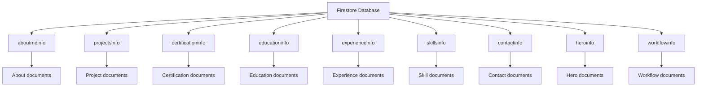

# Firestore Collections Guide

This document explains the Firestore collection structure for your portfolio website and how to use the auto-generated collections.

## Collection Naming Convention

All collections follow the naming convention: `[sectionName]info`

For example:
- `aboutmeinfo` - About Me section
- `projectsinfo` - Projects section
- `certificationinfo` - Certifications section
- etc.

## Collection Details

### 1. aboutmeinfo
**Purpose**: Stores information about you for the About Me section

**Fields**:
- `title`: Section title
- `content`: Main description text
- `profilePhotoUrl`: URL to your profile photo
- `skills`: Array of skill objects
- `stats`: Object containing experience, projects, and satisfaction data

### 2. projectsinfo
**Purpose**: Stores information about your projects

**Fields**:
- `title`: Project name
- `description`: Short project description
- `longDescription`: Detailed project description
- `images`: Array of image URLs
- `tags`: Array of technology tags
- `repoUrl`: Link to source code repository
- `liveUrl`: Link to live demo
- `category`: Project category
- `date`: Project completion date

### 3. certificationinfo
**Purpose**: Stores your certifications and achievements

**Fields**:
- `title`: Certification name
- `organization`: Issuing organization
- `date`: Date of certification
- `description`: Description of certification
- `logo`: Organization logo URL

### 4. educationinfo
**Purpose**: Stores your educational background

**Fields**:
- `title`: Degree name
- `subtitle`: Institution name
- `period`: Duration of study
- `description`: Description of program
- `location`: Institution location
- `icon`: Emoji icon for display
- `iconColor`: Color class for icon
- `bgColor`: Background color class
- `coursework`: Array of relevant coursework
- `achievements`: Array of achievements

### 5. experienceinfo
**Purpose**: Stores your work experience

**Fields**:
- `title`: Job title
- `subtitle`: Company name
- `period`: Employment period
- `description`: Job description
- `location`: Work location
- `icon`: Emoji icon for display
- `iconColor`: Color class for icon
- `bgColor`: Background color class
- `technologies`: Array of technologies used
- `keyProjects`: Array of key projects

### 6. skillsinfo
**Purpose**: Stores your technical skills

**Fields**:
- `name`: Skill name
- `category`: Skill category (Frontend, Backend, etc.)
- `level`: Skill proficiency level (0-100)
- `icon`: Emoji icon for display
- `description`: Skill description

### 7. contactinfo
**Purpose**: Stores contact information

**Fields**:
- `title`: Section title
- `description`: Contact description
- `phone`: Phone number
- `email`: Email address
- `location`: Physical location
- `socialLinks`: Object containing social media links

### 8. heroinfo
**Purpose**: Stores hero section information

**Fields**:
- `name`: Your name
- `tagline`: Professional tagline
- `description`: Brief introduction
- `profileImageUrl`: Profile image URL
- `resumeUrl`: Resume download link
- `ctaButtons`: Array of call-to-action buttons

### 9. workflowinfo
**Purpose**: Stores your development workflow information

**Fields**:
- `title`: Section title
- `description`: Workflow description
- `steps`: Array of workflow steps
- `additionalInfo`: Additional information about workflow

## How to Use

1. The `generate-firestore-collections.js` script contains sample data for all collections
2. Update the script with your actual data
3. Uncomment the Firebase initialization code
4. Run the script to populate your Firestore database

## Data Model Diagram

## Admin Dashboard Integration

The admin dashboard components can be used to manage these collections:
- Edit About: Modify [aboutmeinfo] collection
- Manage Projects: Modify [projectsinfo] collection
- Manage Certifications: Modify [certificationinfo] collection
- Manage Education: Modify [educationinfo] collection
- Manage Experience: Modify [experienceinfo] collection
- Manage Skills: Modify [skillsinfo] collection
- Manage Contact: Modify [contactinfo] collection

Each admin component is designed to work with the corresponding Firestore collection using the naming convention.